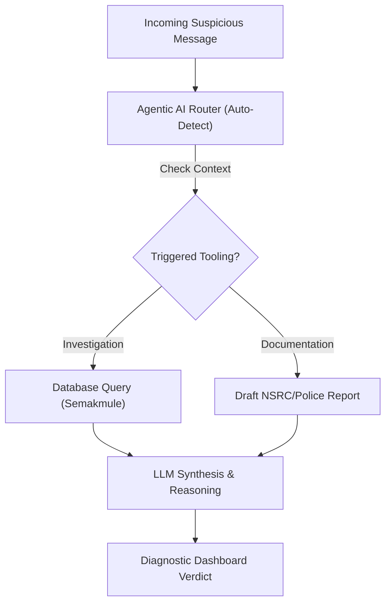

  
  <h1>SoloFraud</h1>
  
<strong>Your Sovereign Autonomous Execution Agentic AI Against Digital Threats in Malaysia</strong>

  
<i>Project 2030: MyAI Future Hackathon | Track 5: Secure Digital (FinTech & Security)</i>

  
  
  
  

---

## 📖 Executive Summary & National Agenda

SoloFraud is a production-hardened, **Autonomous Execution Agentic AI** cybersecurity platform designed to protect Malaysians from the multi-billion ringgit scam pandemic. We align with the **Malaysia Madani** framework and the **NIMP 2030** roadmap, transitioning Malaysia from a passive technology consumer to a **Sovereign Technology Builder**.

By integrating advanced autonomous reasoning directly into the national security conversation, SoloFraud shrinks the response time from "victim in panic" to "actionable reporting" from hours to **3 seconds**.

## 🎯 The "Panic Gap" Problem
In 2023, Malaysians lost **RM1.3 Billion** to scams. Current solutions like Whoscall are *reactive* (relying on databases of old numbers). SoloFraud is **Proactive**—it uses Gemini's reasoning to autonomously detect "Zero-Day" frauds the moment they hit your phone.

## 🧠 Core Architecture: The Sovereign Guardian

SoloFraud operates as an **Autonomous Investigation Agent**, moving beyond simple "chat" into a workflow that *reasons* and *acts* without requiring technical intervention from the user.

### The Tech Stack
- **The Brains**: A high-speed reasoning chain utilizing `Gemini 2.5 Flash` (Edge Performance) and `Gemini 2.5 Pro` (Deep Reasoning) via the Google GenAI SDK (Vertex Express mode).
- **The Orchestrator**: **Vertex AI Agent Builder and Firebase Genkit** for building Agentic AI workflows, executing native autonomous function calling to cross-reference live web data, query threat intelligence (like Semakmule), and auto-draft NSRC/Police reports.
- **The Infrastructure**: Deployed as a high-performance, containerized service on **Google Cloud Run** (`asia-southeast1`).
- **The Database**: Real-time **Firebase Firestore** sync for a national threat dashboard visibility.

### Agentic Workflow

## 🛡️ The Multi-Layer Security Perimeter
SoloFraud implements an enterprise-grade "Security-at-the-Edge" architecture, ensuring the system cannot be abused or weaponized:

1. **PII Masking (The Mask)**: Auto-redacts Malaysian IC and phone numbers before AI processing to ensure 100% privacy (`scrubPII`).
2. **Injection Defense (The Sentinel)**: Proactively blocks adversarial prompt injections, bot-nets, and "jailbreak" attempts (`isMaliciousPrompt`).
3. **Rate Limiting (The Gatekeeper)**: IP-based sliding-window protection to safeguard national API resources and prevent Denial-of-Wallet attacks.
4. **Resilience (Fail-Soft Rescue AI)**: A deeply nested fallback strategy. If the Genkit Orchestrator fails, it drops to the Vertex Express SDK. If the cloud API goes completely offline, it falls back to a locally hosted **Heuristic Engine** (`offline-shield.ts`), preventing system crashes even during API demand surges.

## ⚖️ Declarations & Ethical Compliance

### AI Tool Disclosure
In accordance with **Section 4 of the Code of Conduct**, the team declares the full use of **Google Antigravity** and **Gemini** as autonomous pair programmers. The human-AI collaboration enabled us to achieve production-level stability and a deeply agentic architecture that would traditionally take months of development.

### Ethical Principles
- **Privacy by Design**: No PII is retained; analysis is purely diagnostic.
- **Grounded Hub**: Designed to be "Vertex AI Search Ready" to plug into national PDRM databases for Grounded RAG.
- **Transparency**: Clear confidence scoring and "Visual Reasoning" icons for every analyzed message.

---
*Built with ❤️ for Malaysia. "Advancing The Nation, Building Solutions With Google AI."*
